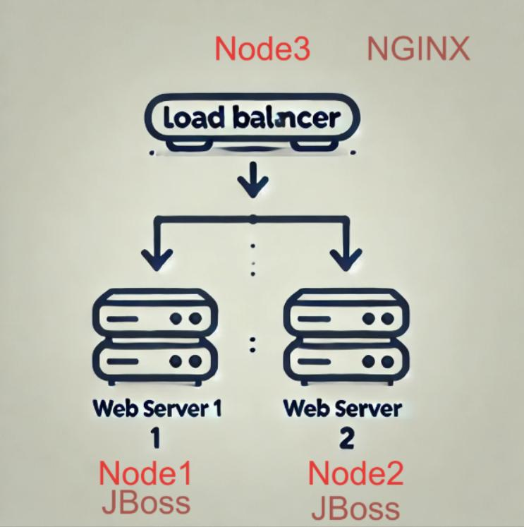

# 🚀 **Ansible Playbook: JBoss Application Deployment and Nginx Load Balancer**

This project contains three Ansible playbooks to automate the deployment, configuration, and validation of JBoss application servers and an Nginx load balancer.



## 📂 **Project Structure**

```
/05-loadbalancers
├── site.yml             # Master playbook to run both roles
├── inventory
├── roles/
│   ├── jboss/
│   │   ├── tasks/
│   │   │   └── main.yml
│   │   ├── handlers/
│   │   │   └── main.yml
│   │   ├── files/
│   │   │   ├── app.jar
│   │   │   └── jboss.service
│   │   └── templates/
│   └── nginx/
│       ├── tasks/
│       │   └── main.yml
│       ├── handlers/
│       │   └── main.yml
│       └── templates/
│           └── nginx.conf.j2
```
### **Login as student into ansible-1 control node:**
```bash
sudo su  - student
mkdir ~/05-loadbalancers
touch ~/05-loadbalancers/site.yml  ~/05-loadbalancers/inventory
mkdir ~/05-loadbalancers/roles
ansible-galaxy init jboss --init-path ~/05-loadbalancers/roles
ansible-galaxy init nginx --init-path ~/05-loadbalancers/roles

touch ~/05-loadbalancers/roles/jboss/files/jboss.service

touch ~/05-loadbalancers/roles/nginx/templates/nginx.conf.j2
cp ~/artifacts/app.jar ~/05-loadbalancers/roles/jboss/files/app.jar
tree ~/05-loadbalancers
cd ~/05-loadbalancers
```
### **Ensure your hosts are defined in the inventroy file:**


**Inventory:** `inventory`
```ini
[loadbalancers]
node3

[jboss_servers]
node1
node2


```


**Files:**
- `app.jar`: JBoss application JAR file.
  ```
   @ /home/student/artifacts/app.jar 

  ```
- `roles/jboss/files/jboss.service`: Systemd service configuration.
  
```
[Unit]
Description=JBoss Swarm Application Script
After=auditd.service systemd-user-sessions.service time-sync.target

[Service]
User=root
TimeoutStartSec=0
Type=simple
KillMode=process
WorkingDirectory=/opt/jboss
ExecStart=/bin/java -jar /opt/jboss/app.jar
Restart=always
RestartSec=2
LimitNOFILE=5555

[Install]
WantedBy=multi-user.target
```

---

---

## 🛠️ **1. roles/jboss**

### **Description:**  
This role installs and configures JBoss application servers on managed hosts.

**Tasks File:** `roles/jboss/tasks/main.yml`

```yaml
---
- name: Install Java runtime
  ansible.builtin.package:
    name: java-1.8.0-openjdk-headless
    state: present

- name: Create JBoss application directory
  ansible.builtin.file:
    path: /opt/jboss
    state: directory

- name: Copy JBoss application JAR
  ansible.builtin.copy:
    src: app.jar
    dest: /opt/jboss/app.jar
    mode: '0644'

- name: Deploy JBoss service
  ansible.builtin.copy:
    src: jboss.service
    dest: /etc/systemd/system/jboss.service
    mode: '0644'
  notify: Reload systemd

- name: Enable and start JBoss service
  ansible.builtin.systemd:
    name: jboss
    enabled: yes
    state: started
```

**Handlers File:** `roles/jboss/handlers/main.yml`

```yaml
---
- name: Reload systemd
  ansible.builtin.systemd:
    daemon_reload: yes

- name: Restart JBoss service
  ansible.builtin.systemd:
    name: jboss
    state: restarted
```

---

## 🧪 **2. roles/nginx**

### **Description:**  
This role installs and configures Nginx as a load balancer for JBoss servers.

**Template File:** `roles/nginx/templates/nginx.conf.j2`

```nginx
worker_processes 1;

events {
    worker_connections 1024;
}

http {
    upstream JBoss_backend {
        
        server {{node}}:8080;
        
    }

    server {
        listen {{ nginx_port }};

        location / {
            proxy_pass http://JBoss_backend;
            proxy_set_header Host $host;
            proxy_set_header X-Real-IP $remote_addr;
            proxy_set_header X-Forwarded-For $proxy_add_x_forwarded_for;
            proxy_set_header X-Forwarded-Proto $scheme;
        }
    }
}
```
**Vars File:** `roles/nginx/defaults/main.yml`

```yaml
---
nginx_port: 8080

```

**Tasks File:** `roles/nginx/tasks/main.yml`

```yaml
---
- name: Install Nginx
  ansible.builtin.package:
    name: nginx
    state: present

- name: Deploy Nginx configuration
  ansible.builtin.template:
    src: nginx.conf.j2
    dest: /etc/nginx/nginx.conf
    mode: '0644'
  notify: Reload Nginx

- name: Enable and start Nginx service
  ansible.builtin.systemd:
    name: nginx
    enabled: yes
    state: started


#Deal with Firewall block
- name: Manage firewalld stuff
  block:
  # Check if firewalld is running on the system
  - name: Check if firewalld is running
    ansible.builtin.service_facts:

  # Ensure the firewall allows necessary services
  - name: Ensure web server ports are open
    ansible.posix.firewalld:
      state: enabled
      permanent: true
      immediate: true
      port: "{{ nginx_port }}/tcp"
    when: 
    - "'firewalld.service' in ansible_facts.services"
    - ansible_facts.services['firewalld.service'].state == 'running'
```

**Handlers File:** `roles/nginx/handlers/main.yml`

```yaml
---
- name: Reload Nginx
  ansible.builtin.systemd:
    name: nginx
    state: reloaded
```


## 📋 **3. site.yml**

### **Description:**  
This master playbook imports and executes the `jboss` and `nginx` roles sequentially.

```yaml
---
- name: Deploy JBoss application servers
  hosts: jboss_servers
  become: true
  roles:
    - jboss

- name: Configure Nginx load balancer
  hosts: loadbalancers
  become: true
  roles:
    - nginx
```

---

### 🚦 **Run the Playbook:**
```bash
ansible-navigator run site.yml -m stdout -i inventory 
```

### 🚦  **Verify: Ensure the Loadbalanacing**
Execute the following command multiple times to verify that the load balancer is functioning properly with the backend servers.

```bash
curl http://node3:8080

```
**Expected response:** '.... ... . . from **node1**'

```bash
curl http://node3:8080

```
**Expected response:** '.... ... . . from **node2**'

**Expected Output:**
   - All tasks should complete successfully.
   - JBoss servers should be running.
   - Nginx should forward requests to the backend JBoss servers.

---

## 🛠️ ** playbook_clean.yml **

### **Description:**  
This playbook cleans the environment.

```yaml
---
- name: Clean the environment
  hosts: all
  become: true

  vars:
    packages:
      - nginx
      - java-headless
    services:
    - nginx
    - jboss

  tasks:
    # Removed previously installed packages
    - name: Uninstall packages
      ansible.builtin.dnf:
        name: "{{ item }}"
        state: absent
      loop: "{{ packages }}"

    # Stop previously enabled services
    - name: Disable and stop services
      ansible.builtin.systemd:    
        name: "{{ item }}"
        enabled: no
        state: stopped
      loop: "{{ services }}"
      ignore_errors: yes


```
   ```bash
   ansible-navigator run playbook_clean.yml -i inventory -m stdout 
   ```
